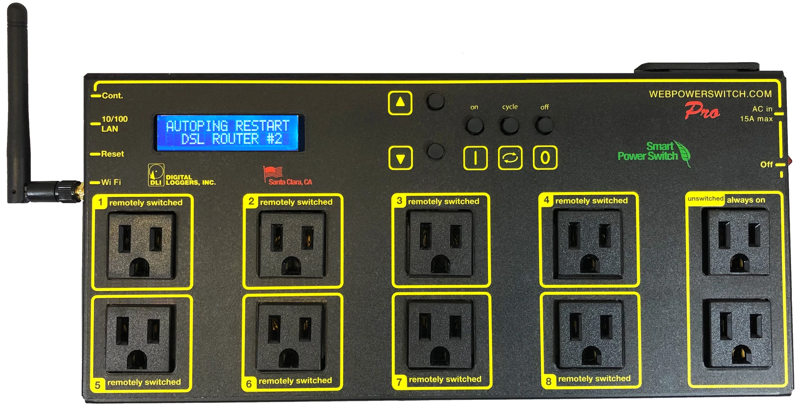
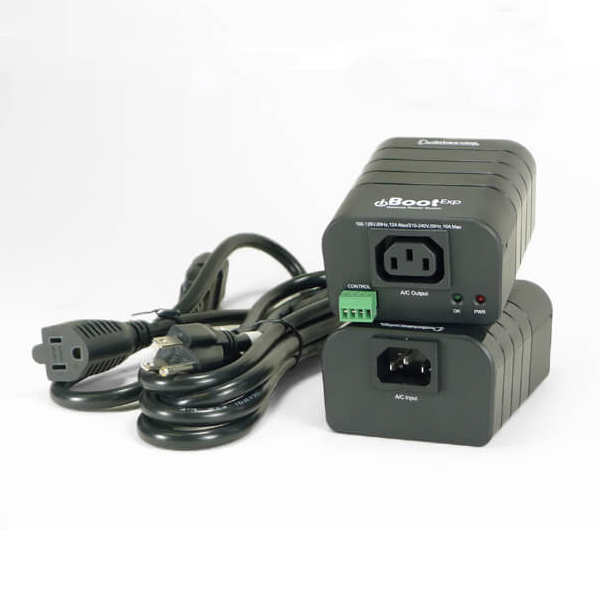

.. _Introduction:

Introduction
=================

An NPS (Network Power Switch) is a device that can control multiple power switches through a network. By connecting the power of the LVM-I Spectroograph Box and subsystem through this device, the power of each device can be controlled through the network. 

LVM-I selected two models for NPS. 
In the LVM-I SCP, we decide to use “web power switch pro” by digital loggers(dli) for NPS. More details can be found through `dli <https://dlidirect.com/products/new-pro-switch>`_ 
In the LVM-I TCP, we're using iboot web power switch in dataprobe Co.(iboot). More details can be found through `iboot <https://dataprobe.com/iboot/>`_ 
We updated *switch* moduel for the nps control library applicable to both models. The powerswitch class is created for the basic modules of dli and iboot and used in the actor command.

dli
------

The digital loggers provides a library made to control the power switch for the above models. Based on this module, the KHU team redefines and asynchronously changes the functions required for the command in SCP. This module plays a role in web crawling from the index web page that provides information about the power switch and controlling the power. For asynchronous web crawling, the asynchronous class provided by httpx was used instead of the default requests library. We also overridden the rest of the functions asynchronously. A new module for controlling power switch is defined as *lvmpower.py*.

iboot
-------

Start the actor
----------------

Start ``lvmnps`` actor.

::

    $ lvmnps start

In another terminal, type ``clu`` and ``lvmnps ping`` for test.

::

    $ clu
    lvmnps ping
         07:41:22.636 lvmnps > 
         07:41:22.645 lvmnps : {
             "text": "Pong."
             }

Stop ``lvmnps`` actor.

::

    $ lvmnps stop

Config file structure
---------------------

::

    switches:
        name_your_switch_here:    # should be a unique name
            type: dummy           # currently dummy, iboot, dli
            num: 8                # number of ports 
            ports: 
              1: 
                name: "skyw.pwi"  # should also be a unique name
                desc: "Something that make sense"
        should_be_a_unique_name:
            type: dummy
            ports:
              1:  
                name: "skye.pwi"
                desc: "PlaneWavemount Skye"

Status return for all commands
------------------------------

-  if 'name' is not defined then the port name will be 'switch
   name'.'port number' eg nps\_dummy\_1.port1 otherwise 'name' from the
   config file will be used.
-  STATE: 1: ON, 0: OFF, -1: UNKNOWN

   ::

            "STATUS": {
             "nps_dummy_1.port1": {
                 "STATE": -1,
                 "DESCR": "was 1",
                 "SWITCH": "nps_dummy_1",
                 "PORT": 1
             },

Run the example lvmnps\_dummy
-----------------------------

::

    #> cd lvmnps
    #> poetry run lvmnps -vvv -c $(pwd)/python/lvmnps/etc/lvmnps_dummy.yml start

    #> poetry run clu

-  status command without parameter returns all ports of all switches.
-  the default is to return only configured ports, otherwise define
   'ouo' false in the config file, see
   `lvmnps\_dummy.yml <https://github.com/sdss/lvmnps/blob/master/python/lvmnps/etc/lvmnps_dummy.yml>`__

   ::

            lvmnps status all

            12:02:08.649 lvmnps > 
            12:02:08.660 lvmnps i {
                "STATUS": {
                    "nps\_dummy\_1.port1": {
                        "STATE": -1, 
                        "DESCR": "was 1", 
                        "SWITCH": "nps\_dummy\_1", 
                        "PORT": 1 
                        }, 
                     "skye.what.ever": {
                         "STATE": -1,
                         "DESCR": "whatever is connected to skye", 
                         "SWITCH": "nps\_dummy\_1",
                         "PORT": 2 
                         }, 
                     "skyw.what.ever": { 
                         "STATE": -1, 
                         "DESCR": "Something @ skyw", 
                         "SWITCH": "nps\_dummy\_1", 
                         "PORT": 4 
                         }, 
                     "skye.pwi": { 
                         "STATE":-1, 
                         "DESCR": "PlaneWavemount Skye", 
                         "SWITCH": "skye.nps", 
                         "PORT": 1
                         }, 
                     "skyw.pwi": { 
                         "STATE": -1, 
                         "DESCR": "PlaneWavemount Skyw",
                         "SWITCH": "nps\_dummy\_3", 
                         "PORT": 1 
                         } 
                    }
                }

-  status command with port name skyw.what.ever

   ::

            lvmnps status what skyw.what.ever

            12:07:12.349 lvmnps > 
            12:07:12.377 lvmnps i { 
                "STATUS": {
                    "skyw.what.ever": { 
                        "STATE": -1, 
                        "DESCR": "Something @ skyw",
                        "SWITCH": "nps\_dummy\_1", 
                        "PORT": 4 
                        }

-  status command with switch name nps\_dummy\_1

   ::

            lvmnps status what nps\_dummy\_1

            12:07:12.349 lvmnps > 
            12:12:21.349 lvmnps i { 
                "STATUS": {
                    "nps\_dummy\_1.port1": { 
                        "STATE": -1, 
                        "DESCR": "was 1", 
                        "SWITCH": "nps\_dummy\_1", 
                        "PORT": 1 
                        }, 
                    "skye.what.ever": { 
                        "STATE": -1,
                        "DESCR": "whatever is connected to skye", 
                        "SWITCH": "nps\_dummy\_1",
                        "PORT": 2 
                        }, 
                    "skyw.what.ever": { 
                        "STATE": -1, 
                        "DESCR": "Something @ skyw", 
                        "SWITCH": "nps\_dummy\_1", 
                        "PORT": 4 
                        } 
                    } 
                }

-  status command with switch name nps\_dummy\_1 and port 4 returns

   ::

            lvmnps status what nps\_dummy\_1 4

            12:07:12.349 lvmnps > 
            12:12:21.349 lvmnps i { 
                "STATUS": {
                    "skyw.what.ever": { 
                        "STATE": -1, 
                        "DESCR": "Something @ skyw",
                        "SWITCH": "nps\_dummy\_1", 
                        "PORT": 4 
                        } 
                    } 
                }

-  the commands on and off use the same addressing scheme as status